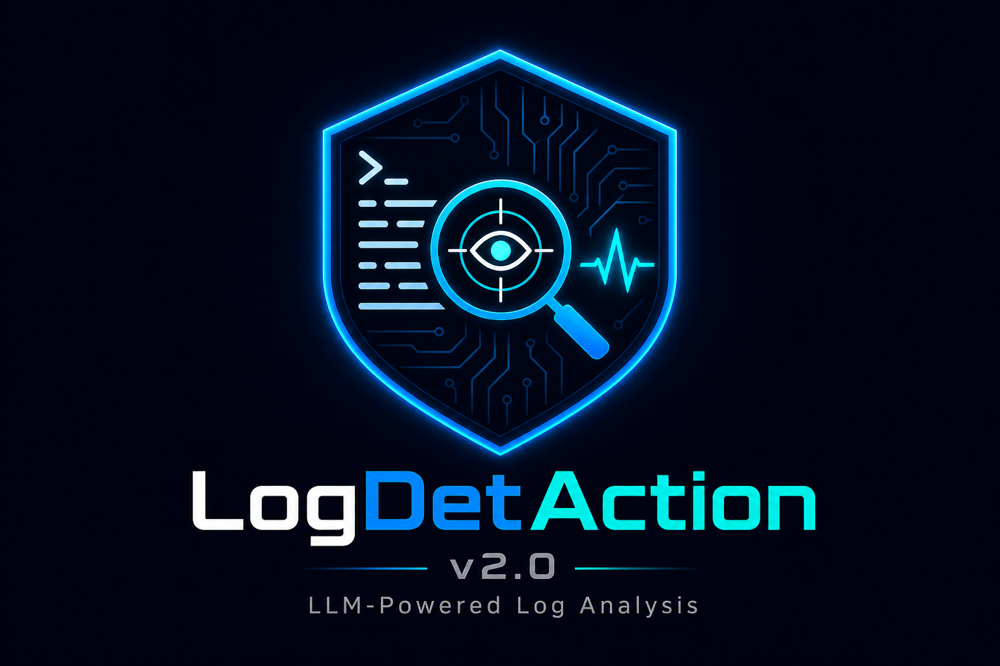

# LogDetAction v2.0: LLM Tabanlı Siber Güvenlik Log Analiz Sistemi

## Bitirme Projesi İkinci Dönem Final Raporu

---

**Üniversite:** [EKLENECEK: Üniversite adı]  
**Fakülte:** [EKLENECEK: Fakülte adı]  
**Bölüm:** Bilgisayar Mühendisliği  
**Ders:** BM495 / BM496 Bitirme Projesi  
**Proje Adı:** LogDetAction v2.0 — LLM Tabanlı Siber Güvenlik Log Analiz Sistemi  
**Öğrenci:** Yaren Dönmez  
**Danışman:** [EKLENECEK: Danışman adı ve unvanı]  
**Dönem:** 2025–2026 Bahar  
**Tarih:** Mayıs 2026  

---



> [EKLENECEK: Üniversitenin resmi kapak sayfası formatı ve logo]

---

## İçindekiler

1. [Özet / Abstract](#1-özet--abstract)
2. [Giriş](#2-giriş) — Problem Tanımı / Motivasyon / Kapsam / Tasarım Boyutu / Mühendislik Problemi / Ders Becerileri / Kullanılan Araçlar / Sertifikalar
3. [Arka Plan ve İlk Dönem Özeti](#3-arka-plan-ve-i̇lk-dönem-özeti)
4. [Veri Seti Hazırlama](#4-veri-seti-hazırlama)
5. [Yöntem](#5-yöntem)
6. [Sistem Mimarisi](#6-sistem-mimarisi)
7. [Uygulama](#7-uygulama)
8. [Deneysel Sonuçlar](#8-deneysel-sonuçlar)
9. [Arayüz ve Görsel Sonuçlar](#9-arayüz-ve-görsel-sonuçlar)
10. [Tartışma](#10-tartışma)
11. [Sınırlılıklar](#11-sınırlılıklar)
12. [Gelecek Çalışmalar](#12-gelecek-çalışmalar)
13. [Sonuç](#13-sonuç)
14. [Kaynaklar](#14-kaynaklar)
15. [Ekler](#15-ekler)

---

## 1. Özet / Abstract

### Türkçe Özet

Bu çalışma, siber güvenlik loglarını yerel GPU destekli bir Büyük Dil Modeli (LLM) pipeline'ı ile analiz eden LogDetAction v2.0 sisteminin ikinci dönem geliştirme sürecini ve sonuçlarını sunmaktadır. Sistem, her log satırını `benign`, `suspicious` veya `malicious` olarak sınıflandırmakta; riskli loglar için teknik açıklama ve Güvenlik Operasyon Merkezi (SOC) odaklı aksiyon önerileri üretmektedir.

İkinci dönemde gerçekleştirilen çalışmalar şu başlıklar altında özetlenebilir: Cowrie honeypot ve HDFS log kaynaklarından oluşan 200.000 örnekli instruction dataset hazırlanmıştır; `mistralai/Mistral-7B-Instruct-v0.2` modeli QLoRA yöntemiyle yerel NVIDIA RTX 4060 Laptop GPU üzerinde ince ayar yapılmıştır; classifier-only QLoRA adapter `qlora_classifier_test_model`, 100 örneklik rastgele testte %99 üç sınıf doğruluğu ve %100 saldırı tespit doğruluğu ile 0.777 saniye ortalama inference süresi elde etmiştir. Bunların yanı sıra modüler LLM-A / LLM-B / LLM-C pipeline mimarisi gerçekleştirilmiş; FastAPI backend, React + Vite frontend, SQLite kalıcı depolama, CSV dışa aktarma, analitik gösterge paneli ve canlı log izleme modülü içeren tam bir yerel web uygulaması geliştirilmiştir.

Sistem yalnızca okuma/analiz amaçlıdır; herhangi bir otomatik güvenlik müdahalesi gerçekleştirmemektedir. Bu özellik, yanlış pozitifler nedeniyle oluşabilecek sistem hasarını önlemeye yönelik bilinçli bir güvenlik kararıdır.

**Anahtar Kelimeler:** Siber güvenlik, log analizi, büyük dil modeli, QLoRA, ince ayar, SOC, FastAPI, React, SQLite, anomali tespiti

---

### English Abstract

This report presents the second-term development and results of LogDetAction v2.0, a cybersecurity log analysis system powered by a locally running, GPU-assisted Large Language Model (LLM) pipeline. The system classifies each log line as benign, suspicious, or malicious, and generates technical explanations and SOC-oriented action recommendations for risky logs.

Second-term contributions include: a 200,000-sample instruction dataset built from Cowrie honeypot and HDFS log sources; QLoRA fine-tuning of `mistralai/Mistral-7B-Instruct-v0.2` on a local NVIDIA RTX 4060 Laptop GPU; a classifier-only adapter (`qlora_classifier_test_model`) achieving 99% three-class accuracy, 100% attack detection accuracy, and 0.777 s mean inference time on a 100-sample random test; a modular LLM-A / LLM-B / LLM-C pipeline architecture; and a full local web application comprising a FastAPI backend, React + Vite frontend, SQLite persistence, CSV export, analytics dashboard, and live log monitoring module.

The system is strictly read-only and performs no automatic security enforcement actions, a deliberate safety decision to avoid harm from false positives.

**Keywords:** Cybersecurity, log analysis, large language model, QLoRA, fine-tuning, SOC, FastAPI, React, SQLite, anomaly detection

---

## 2. Giriş

### 2.1 Problem Tanımı

Siber güvenlik operasyonlarında log analizi, saldırı tespiti ve anomali belirleme süreçlerinin temel bileşenini oluşturmaktadır. Kurumsal ortamlarda web sunucuları, güvenlik duvarları, kimlik doğrulama sistemleri ve dağıtık dosya sistemleri gibi altyapı bileşenleri sürekli olarak büyük hacimli log verileri üretmektedir. Bu verilerin manuel olarak incelenmesi, özellikle uzman SOC analistleri için hem zaman alıcı hem de dikkat yorgunluğuna yol açan bir süreçtir.

Mevcut kural tabanlı SIEM sistemleri önceden tanımlanmış imzalara göre uyarı üretmektedir. Bu yaklaşım, bilinen saldırı kalıpları için etkili olmakla birlikte bağlama duyarlı anomalileri ve önceden bilinmeyen saldırı davranışlarını tespit etmekte yetersiz kalmaktadır. Büyük dil modellerinin log içeriğini semantik düzeyde anlayabilmesi, bu boşluğu kısmen doldurmaya yönelik yeni bir yaklaşım sunmaktadır.

### 2.2 Motivasyon

Bu proje; LLM tabanlı log sınıflandırmasının yerel donanımda uygulanabilirliğini göstermek, domain-specific QLoRA ince ayarının sınıflandırma performansını ne ölçüde artırdığını ölçmek ve analiz sonuçlarını bir SOC analistinin kullanabileceği web arayüzü üzerinden sunmak amacıyla başlatılmıştır.

Çalışma, ticari bulut tabanlı çözümlere gerek kalmadan yerel GPU donanımı üzerinde çalışabilen, veri gizliliğine duyarlı bir prototip geliştirmeyi hedeflemektedir.

### 2.3 Proje Kapsamı

LogDetAction v2.0 aşağıdaki özellikleri kapsamaktadır:

- Dosya yükleme, manuel log girişi ve canlı log izleme yoluyla log kabulü
- Her log satırı için `benign / suspicious / malicious` sınıflandırması
- Riskli loglar için teknik açıklama ve SOC önerisi üretimi
- İki analiz modu: Fast Mode / Combined ve Detailed Mode / Separate
- SQLite veritabanına kalıcı depolama ve CSV dışa aktarma
- Analitik gösterge paneli ve geçmiş görüntüleme
- Türkçe / İngilizce dil desteği

Proje kapsamı **dışında** olan konular şunlardır: gerçek zamanlı otomatik güvenlik müdahalesi, kimlik doğrulama, çok kullanıcılı destek ve bulut dağıtımı.

### 2.4 İkinci Dönem Hedefi

Birinci dönem raporunda temel LLM inference altyapısı ve veri hazırlama süreçleri ele alınmıştı. Bu dönemin hedefi, aşağıdaki somut çıktıları üretmektir:

1. Domain-specific QLoRA ince ayar modellerinin eğitilmesi ve değerlendirilmesi
2. Modüler LLM-A / LLM-B / LLM-C pipeline mimarisinin gerçekleştirilmesi
3. Birinci dönem CLI prototipinin yerel bir web uygulamasına dönüştürülmesi

### 2.5 Projenin Tasarım Boyutu

Bu proje, sıfırdan tasarlanmış özgün bir mühendislik çalışmasıdır. Mevcut bir projenin tekrarı değildir; aynı zamanda herhangi bir kurumsal veya açık kaynak projenin parçası da değildir. Birinci dönemde (BM495) başlanan çalışma, LLM-ThreatDetAction adıyla tasarlanmış; ardından kapsam genişletilerek LogMistral ve nihayetinde LogDetAction v2.0 adını almıştır.

Tasarım, üç katmandan oluşan özgün bir mimaridir:

- **Model katmanı:** Siber güvenlik log analizi için sıfırdan derlenmiş 200.000 örnekli instruction dataset ve bu veri üzerinde QLoRA yöntemiyle yerel olarak eğitilmiş iki özgün adaptör (`qlora_classifier_test_model`, `qlora_test_model`).
- **Pipeline katmanı:** Stepwise inference ve modüler LLM-A / LLM-B / LLM-C ayrımını içeren özgün bir analiz akışı.
- **Uygulama katmanı:** FastAPI backend ve React frontend içeren, SQLite kalıcı depolama, canlı log izleme ve analitik gösterge paneli barındıran özgün yerel web uygulaması.

Proje, birinci dönem çalışmasının doğrudan ikinci döneme taşınan ve kapsamı genişletilerek tamamlanan devamı niteliğindedir.

### 2.6 Mühendislik Problemi ve Çözüm

**Problem:** Siber güvenlik log analizi yüksek hacimli veri üretmekte; bu verilerin uzman SOC analistleri tarafından manuel olarak incelenmesi hem zaman alıcı hem de dikkat yorgunluğuna yol açmaktadır. Mevcut kural tabanlı SIEM sistemleri ise yalnızca önceden tanımlanmış imzalara göre çalıştığından bağlama duyarlı ve daha önce görülmemiş saldırı kalıplarını tespit etmekte yetersiz kalmaktadır.

**Çözüm:** LogDetAction v2.0, her log satırını `benign / suspicious / malicious` olarak sınıflandıran ve riskli loglar için teknik açıklama ile SOC odaklı aksiyon önerisi üreten bir LLM tabanlı analiz sistemidir. Sistem, yerel NVIDIA RTX 4060 GPU üzerinde çalışmakta; böylece kurumların log verilerini üçüncü taraf bulut servislerine göndermeden analiz etmesine olanak tanımaktadır.

Geliştirilen çözümün özgün yanları şunlardır:

- Domain-specific QLoRA ince ayarı ile attack detection accuracy %70'ten %99-100 seviyesine yükseltilmiştir.
- Stepwise inference yaklaşımı ile benign loglar için gereksiz GPU işlemi tamamen ortadan kaldırılmış; classifier-only adaptörde ortalama inference süresi 0.777 saniyeye düşürülmüştür.
- Sistem, tüm önerilen güvenlik aksiyonlarını insan onayına tabi simulated action olarak sunar; hiçbir otomatik müdahale gerçekleştirmez. Bu, yanlış pozitifler nedeniyle oluşabilecek sistem hasarını önleyen bilinçli bir mühendislik kararıdır.

### 2.7 Lisans Eğitiminden Kazanılan Bilgi ve Beceriler

Bu projede aşağıdaki lisans derslerinde edinilen bilgi ve becerilerden yararlanılmıştır:

**Tablo. Proje ile İlişkili Lisans Dersleri**

| Ders | Proje Bileşeniyle İlişki |
|---|---|
| Veri Yapıları ve Algoritmalar | Pipeline akış mantığı, veri işleme döngüleri |
| Veritabanı Sistemleri | SQLite şema tasarımı, ORM kullanımı, CRUD işlemleri |
| Yazılım Mühendisliği | Modüler mimari tasarımı, servis katmanı ayrımı, hata yönetimi |
| Bilgisayar Ağları | HTTP/REST API tasarımı, istemci-sunucu mimarisi |
| İşletim Sistemleri | Async programlama, iş parçacığı (thread) yönetimi, dosya I/O |
| Yapay Zeka / Makine Öğrenmesi | Model eğitimi, değerlendirme metrikleri (accuracy, F1, precision, recall), confusion matrix yorumlama |
| Olasılık ve İstatistik | Sınıf dengesizliği analizi, precision-recall dengesi yorumlama |
| İnsan-Bilgisayar Etkileşimi | Kullanıcı arayüzü tasarımı, SOC analistine yönelik UX kararları |

### 2.8 Kullanılan Modern Araçlar, Yazılımlar ve Teknolojiler

**Tablo. Projede Kullanılan Araç ve Teknolojiler**

| Araç / Teknoloji | Kullanım Amacı |
|---|---|
| Python 3.10+ | Backend geliştirme, model eğitimi, pipeline |
| `transformers` (Hugging Face) | Mistral-7B model yükleme ve inference |
| `peft` (Hugging Face) | QLoRA LoRA adaptör yönetimi |
| `bitsandbytes` | 4-bit quantization (VRAM tasarrufu) |
| `torch` + CUDA | GPU destekli model eğitimi ve inference |
| FastAPI + Uvicorn | Asenkron REST API sunucu |
| SQLAlchemy + aiosqlite | Async ORM ve SQLite veritabanı yönetimi |
| pydantic-settings | Ortam değişkeni tabanlı yapılandırma |
| React 18 + Vite | Modern web arayüzü geliştirme |
| Tailwind CSS v3 | Utility-first CSS ile SOC temalı koyu arayüz |
| Zustand | Hafif React state yönetimi |
| Recharts | Analitik gösterge paneli grafikleri |
| react-i18next | EN/TR dil desteği (uluslararasılaştırma) |
| Axios | Frontend HTTP istemcisi |
| Git + GitHub | Sürüm kontrolü ve kod deposu |
| LM Studio | Birinci dönemde base model test ortamı |
| VS Code / Cursor | Geliştirme ortamı |
| Windows PowerShell | Otomasyon, sanal ortam ve komut yönetimi |

### 2.9 Ders Dışı Sertifikalar ve Yetkinlikler

> [EKLENECEK: Varsa Coursera, Udemy, NVIDIA CUDA, Hugging Face veya benzeri platformlardan alınan siber güvenlik, makine öğrenmesi veya LLM eğitimleri buraya eklenecek]

---

## 3. Arka Plan ve İlk Dönem Özeti

### 3.1 İlk Dönem Prototipi: LLM-ThreatDetAction / LogMistral

Birinci dönem çalışmasında projenin temel kavramsal çerçevesi ve ilk prototipi oluşturulmuştu. Bu aşamada LLM-ThreatDetAction adıyla başlayan çalışma, LogMistral olarak yeniden adlandırılan bir CLI tabanlı prototip haline getirilmişti.

İlk prototip aşağıdaki özellikleri içermekteydi:

- `mistralai/Mistral-7B-Instruct-v0.2` tabanlı yerel LLM inference
- LM Studio üzerinden local API server entegrasyonu
- Python backend ile HTTP POST tabanlı log gönderimi
- Otomatik evaluation scripti ile doğruluk ve inference süresi ölçümü
- JSONL formatında depolama
- Flask tabanlı basit web prototipi

### 3.2 İlk Dönem Model Karşılaştırmaları

Birinci dönemde üç farklı model üzerinde karşılaştırmalı deney yapılmıştır.

**Tablo 1. İlk Dönem Model Karşılaştırması**


| Model                    | Test Boyutu | 3-Class Accuracy | Attack Det. Accuracy | Ort. Gecikme |
| ------------------------ | ----------- | ---------------- | -------------------- | ------------ |
| Mistral-7B-Instruct-v0.2 | 50 log      | %98              | —                    | ~1.25 sn/log |
| Mistral-7B-Instruct-v0.2 | 100 log     | ~%100            | ~%97 F1              | ~1.25 sn/log |
| Mistral-7B-Instruct-v0.2 | 500 log     | %81              | —                    | ~24 sn/log   |
| Qwen 2.5-3B              | 10 log      | %0               | —                    | —            |
| Qwen 2.5-3B              | 50 log      | %36              | —                    | —            |
| Qwen 2.5-3B              | 100 log     | %49              | —                    | —            |
| Phi-2                    | 10 log      | %60              | —                    | —            |
| Phi-2                    | 50 log      | %55              | —                    | —            |
| Phi-2                    | 100 log     | %51              | —                    | —            |
| Phi-2                    | 500 log     | %54              | —                    | —            |


> [EKLENECEK: Birinci dönem raporundan (BM495_PROJE_DÖNEMSONURAPORU_Y.DONMEZ_20252026_BAHAR.pdf) F1 ve ek metrik değerleri aktarılacak]

Bu sonuçlara göre `Mistral-7B-Instruct-v0.2` modeli, küçük ve orta ölçekli test setlerinde diğer modellere kıyasla belirgin biçimde üstün performans göstermiştir. Bu nedenle proje tabanı olarak Mistral-7B seçilmiştir.

### 3.3 İlk Dönem Sınırlılıkları

Birinci dönem çalışmasında şu sınırlılıklar tespit edilmişti:

1. **Domain bilgisi eksikliği:** Base model, Cowrie honeypot bağlamını öğrenmemişti. Örneğin `Remote SSH version: SSH-2.0-libssh-0.6.3` gibi loglar benign olarak sınıflandırılmaktaydı.
2. **Yüksek inference süresi:** Büyük log setlerinde (~500 satır) süre log başına 24 saniyeye ulaşıyordu.
3. **Açıklama kalitesi:** Üretilen açıklamalar log tipine özgü değil, genel ve tekrarlayıcıydı.
4. **İnce ayar eksikliği:** Base model prompt engineering ile yönlendiriliyordu; domain adaptation gerçekleştirilmemişti.
5. **Weak labeling:** HDFS suspicious etiketlerinin satır bazlı değil, block-level anomaly bağlamına dayandığı belirlenmişti.
6. **Altyapı:** Flask tabanlı prototip, üretim kalitesinde API ve arayüz için yeterli değildi.

İkinci dönem çalışmaları bu sınırlılıkların üzerine inşa edilmiştir.

### 3.4 Birinci ve İkinci Dönem Karşılaştırması

İlk dönem raporunda NoSQL depolama ve Flask prototipi yer alırken, ikinci dönem uygulamasında FastAPI, SQLite ve React tabanlı daha modüler bir web mimarisi geliştirilmiştir. Benzer şekilde, ilk dönemde base model prompt mühendisliği ile yönlendiriliyorken, ikinci dönemde domain-specific QLoRA ince ayar modelleri eğitilmiş ve pipeline'a entegre edilmiştir.

---

## 4. Veri Seti Hazırlama

### 4.1 Donanım Ortamı

Tüm veri hazırlama, model eğitimi ve inference işlemleri aşağıdaki yerel donanım ortamında gerçekleştirilmiştir.

**Tablo 2. Geliştirme Ortamı Donanım Özellikleri**


| Bileşen         | Özellik                            |
| --------------- | ---------------------------------- |
| İşlemci         | Intel Core i7-13650HX              |
| Ekran Kartı     | NVIDIA GeForce RTX 4060 Laptop GPU |
| VRAM            | 8 GB                               |
| RAM             | 16 GB                              |
| Depolama        | NVMe SSD                           |
| İşletim Sistemi | Windows 11                         |
| CUDA            | Aktif                              |


Bu donanım yapılandırmasında tam ölçekli LLM eğitimi VRAM kapasitesi nedeniyle mümkün değildir; ancak 4-bit quantization ile QLoRA ince ayarı başarıyla gerçekleştirilebilmektedir.

### 4.2 Veri Kaynakları

Projede iki farklı gerçek dünya log kaynağı kullanılmıştır.

#### 4.2.1 Cowrie Honeypot Logları

Cowrie, SSH/Telnet saldırganlarını tuzağa düşürmek için tasarlanmış açık kaynaklı bir honeypot sistemidir. Bu veri setinde saldırgan davranışlarını temsil eden log kayıtları bulunmaktadır. Tüm Cowrie kayıtları `malicious` olarak etiketlenmiştir.

Cowrie veri setindeki başlıca olay tipleri:

- `cowrie.command.input` — Saldırgan tarafından çalıştırılan komutlar
- `cowrie.login.failed` / `cowrie.login.success` — Kimlik doğrulama girişimleri
- `cowrie.session.connect` / `cowrie.session.closed` — SSH oturum olayları
- `cowrie.session.file_download` — Zararlı dosya indirme girişimleri
- `cowrie.client.version` — Saldırgan SSH istemci bilgisi

**Örnek Cowrie log satırları:**

```
Failed password for root from 192.168.1.25 port 55221 ssh2
Remote SSH version: SSH-2.0-libssh-0.6.3
CMD: cat /proc/cpuinfo | grep name | wc -l
SSH client hassh fingerprint: 51cba57125523ce4b9db67714a90bf6e
```

#### 4.2.2 HDFS Logları

HDFS (Hadoop Distributed File System) logları dağıtık dosya sisteminin normal operasyon ve anomali kayıtlarını içermektedir. Bu veri setinde `benign` ve `suspicious` etiketli kayıtlar bulunmaktadır. Suspicious etiketleri, bireysel log satırındaki açık bir saldırı göstergesinden değil, block-level anomaly bağlamından kaynaklanmaktadır; bu durum ileride tartışılacak önemli bir akademik sınırlılık oluşturmaktadır.

**Örnek HDFS log satırları:**

```
081109 204512 26 INFO dfs.FSNamesystem: BLOCK* NameSystem.addStoredBlock: blockMap updated: 10.251.203.166:50010 is added to blk_-2299586501391716260 size 67108864
081109 203945 308 INFO dfs.DataNode$PacketResponder: Received block blk_-9207533323239283317 of size 67108864 from /10.251.111.130
```

### 4.3 Gelişmiş Instruction Dataset

İlk instruction dataset'inde açıklamaların log tipine özgü olmadığı gözlemlenmiştir. Bu sorunu gidermek amacıyla gelişmiş bir instruction dataset oluşturulmuştur. Bu veri setinde her örnek şu yapıya sahiptir:

```json
{
  "instruction": "Analyze the following cybersecurity log entry and classify it as benign, suspicious, or malicious. Then provide a technical explanation and a SOC-oriented recommendation.",
  "input": "<log satırı>",
  "output": "Label: malicious\nExplanation: ...\nRecommendation: ..."
}
```

**Tablo 3. Gelişmiş Instruction Dataset Dağılımı**


| Kaynak     | Örnek Sayısı |
| ---------- | ------------ |
| Cowrie     | 100.000      |
| HDFS       | 100.000      |
| **Toplam** | **200.000**  |


| Etiket     | Örnek Sayısı | Oran     |
| ---------- | ------------ | -------- |
| malicious  | 100.000      | %50.00   |
| benign     | 96.951       | %48.48   |
| suspicious | 3.049        | %1.52    |
| **Toplam** | **200.000**  | **%100** |


| Split      | Örnek Sayısı |
| ---------- | ------------ |
| Train      | 160.000      |
| Validation | 20.000       |
| Test       | 20.000       |


Suspicious sınıfının veri setindeki oranının düşük (%1.52) olması, sonraki aşamalarda suspicious sınıfı sınıflandırma performansını etkileyen temel faktörlerden biri olmuştur.

### 4.4 Classifier-Only Dataset

Full-output QLoRA modelinin yalnızca etiket üretme görevinde zayıf performans gösterdiği tespit edilmiştir (bkz. Bölüm 8.3). Bu sorunu çözmek amacıyla ayrı bir classifier-only dataset hazırlanmıştır. Bu veri setinde açıklama ve öneri kaldırılmış; model çıktısı yalnızca etiketten oluşmaktadır:

```json
{
  "instruction": "Classify the following cybersecurity log entry using only one label: benign, suspicious, or malicious.",
  "input": "<log satırı>",
  "output": "Label: malicious"
}
```

**Tablo 4. Classifier-Only Dataset Split**


| Split      | Örnek Sayısı |
| ---------- | ------------ |
| Train      | 160.000      |
| Validation | 20.000       |
| Test       | 20.000       |


Test eğitiminde (smoke test) kullanılan 1.000 örneklik alt kümenin sınıf dağılımı:


| Etiket     | Örnek Sayısı |
| ---------- | ------------ |
| benign     | 503          |
| malicious  | 485          |
| suspicious | 12           |


Bu dağılım, test eğitimindeki alt kümede suspicious sınıfının çok az temsil edildiğini göstermektedir.

---

## 5. Yöntem

### 5.1 QLoRA İnce Ayar Yöntemi

Yerel donanımda 7 milyar parametreli bir modelin tam ölçekli eğitimi VRAM kapasitesi açısından mümkün değildir. Bu sorunu çözmek amacıyla QLoRA (Quantized Low-Rank Adaptation) yöntemi kullanılmıştır.

QLoRA'nın temel bileşenleri:

- **4-bit Quantization:** Modelin ağırlıkları 4-bit formatında yüklenir; bu sayede VRAM kullanımı ciddi biçimde azalır.
- **LoRA Adapter:** Model ağırlıklarının tamamı değil, yalnızca eklenen küçük adapter katmanlarının parametreleri eğitilir.
- **PEFT Kütüphanesi:** Hugging Face `peft` kütüphanesi ile LoRA adapter katmanları modele eklenmektedir.

Bu projede ölçülen eğitilebilir parametre oranı:

```
trainable params:  6.815.744
all params:        7.248.547.840
trainable%:        0.0940
```

Başka bir ifadeyle, modelin 7,2 milyar parametresinin yalnızca yaklaşık %0.094'ü eğitilmektedir. Bu yaklaşım sayesinde mevcut donanımda büyük model üzerinde domain adaptation gerçekleştirmek mümkün hale gelmektedir.

**Eğitim ortamı:**

QLoRA ince ayar süreci için Python sanal ortamında aşağıdaki temel kütüphaneler kullanılmıştır: `torch`, `transformers`, `datasets`, `peft`, `bitsandbytes`. Standart `SFTTrainer` yerine manuel eğitim döngüsü tercih edilmiştir; bunun nedeni Windows ortamında `trl` kütüphanesi ile BF16 mixed precision uyumsuzluğu yaşanmasıdır.

### 5.2 Modüler LLM-A / LLM-B / LLM-C Mimarisi

Pipeline üç mantıksal modüle ayrılmıştır:

**Tablo 5. LLM Modül Tanımları**


| Modül | Adapter / Model               | Görev                                             | Ne Zaman Çalışır                     |
| ----- | ----------------------------- | ------------------------------------------------- | ------------------------------------ |
| LLM-A | `qlora_classifier_test_model` | `benign / suspicious / malicious` sınıflandırması | Her log satırında                    |
| LLM-B | `qlora_test_model`            | Teknik açıklama üretimi                           | Yalnızca malicious / riskli loglarda |
| LLM-C | `qlora_test_model`            | SOC odaklı aksiyon önerisi                        | Yalnızca malicious / riskli loglarda |


> **Önemli Not:** Mevcut prototipte LLM-B ve LLM-C mantıksal olarak ayrılmış modüllerdir; ancak her ikisi de aynı Mistral tabanlı `qlora_test_model` adapter'ını farklı prompt yapılandırmalarıyla kullanmaktadır. Bunun nedeni yerel donanımdaki 8 GB VRAM kısıtıdır. Mimari, ileride daha güçlü donanım kullanıldığında LLM-B ve LLM-C'nin bağımsız özelleşmiş adaptörlerle değiştirilebilmesine uygun biçimde tasarlanmıştır.

### 5.3 Stepwise (Adım Adım) Inference

Full-output QLoRA modeli, benign loglar için de açıklama ve öneri üretmekteydi; bu durum gereksiz hesaplama maliyeti oluşturuyordu. Stepwise inference yaklaşımında akış şu şekilde düzenlenmiştir:

```
Log satırı gelir
        ↓
    LLM-A: Sınıflandırma
        ↓
   ┌────────────────────────────────────────┐
   │                                        │
   ▼                                        ▼
benign                              malicious / suspicious
   │                                        │
no_action                          LLM-B: Açıklama üretimi
açıklama üretilmez                 LLM-C: Öneri üretimi
```

Bu yaklaşım, benign loglarda LLM-B ve LLM-C çağrılarını tamamen ortadan kaldırarak hem inference süresini hem de GPU bellek kullanımını azaltmaktadır.

### 5.4 Suspicious Etiket İşleme Stratejisi

Balanced fine-tuning deneyleri (Bölüm 8.5), HDFS suspicious sınıfının tek satır log düzeyinde güvenilir biçimde ayrılmasının zor olduğunu göstermiştir. Bu nedenle suspicious etiketler için şu strateji benimsenmiştir:

- Sınıflandırıcı `suspicious` tahmin ettiğinde, LLM-B/C tam açıklama yerine "bağlam gereklidir" mesajı üretir.
- Öneri olarak block-level veya session-level korelasyon yapılması önerilir.
- Suspicious, "kesin tehdit" olarak değil, "analist incelemesi gerektirir" bağlamında sunulmaktadır.

Bu strateji, sınıflandırıcının saldırı tespiti (malicious / non-malicious) konusundaki güçlü performansını korurken suspicious sınıfındaki belirsizliği şeffaf biçimde ele almaktadır.

### 5.5 Combined ve Separate Analiz Modları

LLM-B ve LLM-C'nin nasıl çağrılacağına ilişkin iki farklı çalışma modu tasarlanmıştır:

**Tablo 6. Analiz Modu Karşılaştırması**


| Mod                      | İç Değer   | Davranış                                           | Gecikme     |
| ------------------------ | ---------- | -------------------------------------------------- | ----------- |
| Fast Mode / Combined     | `combined` | Açıklama + Öneri tek model çağrısında üretilir     | Daha düşük  |
| Detailed Mode / Separate | `separate` | Açıklama ve Öneri ayrı model çağrılarında üretilir | Daha yüksek |


Combined mode, yerel GPU donanımında düşük gecikme için varsayılan moddur. Separate mode ise modüler LLM-B / LLM-C mimarisini demo amacıyla sergilemek ve ileride ayrı modellere geçişi kolaylaştırmak için tasarlanmıştır.

---

## 6. Sistem Mimarisi

### 6.1 Genel Mimari

**Şekil 1. Sistem Genel Mimarisi**

```
┌─────────────────────────────────────────┐
│         React + Vite Frontend           │
│      localhost:5173  |  Tailwind CSS    │
│  EN/TR dil desteği  |  4 sekme nav      │
└──────────────┬──────────────────────────┘
               │ HTTP / REST API
               ▼
┌─────────────────────────────────────────┐
│           FastAPI Backend               │
│           localhost:8000                │
│  /api/analyze  /api/jobs  /api/results  │
│  /api/dashboard  /api/live  /api/health │
└──────────────┬──────────────────────────┘
               │ asyncio.to_thread (blocking GPU call)
               ▼
┌─────────────────────────────────────────┐
│       QLoRA Mistral-7B Pipeline         │
│                                         │
│  LLM-A: qlora_classifier_test_model     │
│  LLM-B: qlora_test_model (açıklama)     │
│  LLM-C: qlora_test_model (öneri)        │
│                                         │
│  NVIDIA RTX 4060 Laptop GPU / CUDA      │
└──────────────┬──────────────────────────┘
               │
               ▼
┌──────────────┬──────────────────────────┐
│  SQLite DB   │    CSV Export Files      │
│  (aiosqlite) │  backend/results/        │
└──────────────┴──────────────────────────┘
```

### 6.2 Backend Mimarisi

Backend, `FastAPI` + `Uvicorn` ile geliştirilmiştir. Bileşenler şu şekilde ayrılmıştır:

```
backend/
├── main.py                 FastAPI uygulaması, lifespan, CORS
├── config.py               pydantic-settings ile ortam değişkeni yönetimi
├── database.py             async SQLAlchemy + aiosqlite kurulumu
├── models/analysis.py      SQLAlchemy ORM modelleri
├── schemas/analysis.py     Pydantic request/response şemaları
├── routers/
│   ├── upload.py           POST /api/analyze/file
│   ├── manual.py           POST /api/analyze/text
│   ├── results.py          GET  /api/results/*
│   ├── jobs.py             POST/GET /api/jobs/* (iş tabanlı analiz)
│   ├── dashboard.py        GET  /api/dashboard/summary
│   └── live.py             POST/GET /api/live/*
└── services/
    ├── model_loader.py     Model ve adapter'ları başlangıçta tek kez yükler
    ├── pipeline_service.py Temel LLM inference mantığı
    ├── csv_service.py      CSV dışa aktarma
    ├── storage_service.py  SQLite CRUD işlemleri
    ├── dashboard_service.py Analitik agregasyon
    ├── live_monitor_service.py Canlı log izleme döngüsü
    └── job_service.py      İş durumu ve ilerleme takibi
```

**Model yükleme stratejisi:** Modeller FastAPI lifespan olayında yalnızca bir kez yüklenmekte ve singleton olarak saklanmaktadır. İstek başına veya log satırı başına model yüklemesi gerçekleştirilmemektedir.

**Blocking inference yönetimi:** LLM inference işlemi GPU üzerinde senkron çalışmakta ve Python'un GIL'ini meşgul etmektedir. Bu nedenle tüm pipeline çağrıları `asyncio.to_thread()` ile arka plana alınmakta ve FastAPI'nin async olay döngüsü engellenmemektedir.

### 6.3 Frontend Mimarisi

Frontend, `React 18` + `Vite` + `Tailwind CSS v3` ile geliştirilmiştir. Durum yönetimi için `Zustand`, grafik bileşenleri için `Recharts`, uluslararasılaştırma için `react-i18next` kullanılmaktadır.

```
frontend/src/
├── App.jsx                 4 sekmeli üst navigasyon (Analyze / History / Analytics / Live)
├── api/client.js           Axios HTTP istemcisi
├── store/analysisStore.js  Global Zustand store
├── hooks/
│   ├── useAnalysis.js      Dosya ve metin analizi
│   ├── useJobPolling.js    İş durumu polling
│   ├── useDashboard.js     Analitik veri getirme
│   └── useLiveMonitor.js   Canlı izleme durumu ve polling
├── components/
│   ├── layout/             Header
│   ├── input/              FileUploadZone, ManualInputPanel, ModeSelector
│   ├── dashboard/          SummaryCards, ResultTable, FilterBar, SearchInput
│   ├── progress/           ProgressPanel (iş tabanlı ilerleme)
│   ├── history/            HistoryPanel, HistoryDetailView
│   ├── analytics/          AnalyticsDashboard ve alt bileşenler
│   ├── live/               LiveMonitorPanel, LiveEventsTable, LiveStatusCard
│   ├── modals/             LogDetailModal
│   └── shared/             LabelBadge, StatusBadge, AnalystActionPanel
└── i18n/
    ├── en.json
    └── tr.json
```

### 6.4 Veritabanı ve Depolama

Veritabanı olarak SQLite (`aiosqlite` + async SQLAlchemy) kullanılmaktadır. İki ana tablo bulunmaktadır:

`**analyses` tablosu:** Her analiz oturumunun meta verisini saklar (kaynak türü, analiz modu, toplam log sayısı, etiket dağılımı, zamanlama ortalamaları, CSV yolu, durum).

`**log_results` tablosu:** Her log satırının detaylı sonucunu saklar (analiz ID'si, satır indeksi, log metni, etiket, önem derecesi, durum, tüm zamanlama değerleri, açıklama, öneri, simulated action).

CSV dışa aktarma işlemi her analiz tamamlandığında `backend/results/pipeline/` altına benzersiz dosya adıyla kaydedilmektedir. Mevcut dosyaların üzerine yazılmamaktadır.

### 6.5 Canlı İzleme (Live Monitor) Mimarisi

**Uygulanan durum (demo modülü):** Canlı izleme modülü, `backend/live/live_demo.log` dosyasını arka planda asyncio görevi olarak periyodik olarak (varsayılan: 2 saniye) izlemektedir. Yeni eklenen satırlar okunup pipeline üzerinden analiz edilmekte ve sonuçlar SQLite'a kaydedilmektedir.

```
log_generator.py
 (her 2 sn'de bir satır ekler)
        ↓
 live_demo.log dosyası
        ↓
 LiveMonitorService (asyncio task)
 - Dosya boyutunu kontrol eder
 - Yalnızca yeni baytları okur (offset takibi)
 - Dosya küçülmüşse offset sıfırlanır (rotation)
        ↓
 pipeline_service.analyze_single_log()
        ↓
 SQLite log_results tablosuna kayıt
```

> **Kapsam notu:** Canlı izleme modülü bu çalışmada `backend/live/live_demo.log` dosyası üzerinde yerel demo amacıyla çalışmaktadır. Gerçek ortamda bu dosya web sunucu erişim logu, güvenlik duvarı logu, SSH kimlik doğrulama logu, SIEM dışa aktarması veya NMS log çıktısı ile değiştirilebilir.

### 6.6 Güvenli Kapsam Sınırı

**Tablo 7. Güvenli Kapsam Sınırı**


| Kapsam Dahili                              | Kapsam Dışı                            |
| ------------------------------------------ | -------------------------------------- |
| Log analizi ve sınıflandırma               | IP engelleme                           |
| Teknik açıklama üretimi                    | Kullanıcı hesabı kilitleme             |
| SOC önerisi üretimi                        | Dosya silme veya karantinaya alma      |
| Simulated/pending analyst action gösterimi | Servis durdurma                        |
| SQLite depolama                            | Güvenlik duvarı kuralı oluşturma       |
| CSV dışa aktarma                           | Parola sıfırlama                       |
| Canlı log okuma (read-only)                | Harici sistem çağrısı                  |
| Analitik gösterge paneli                   | Herhangi bir gerçek sistem değişikliği |


---

## 7. Uygulama

### 7.1 Backend Uygulaması

#### 7.1.1 Yapılandırma Yönetimi

Tüm yapılandırma değerleri `backend/config.py` üzerinden `pydantic-settings` ile yönetilmektedir. Model yolları, cihaz ayarları, depolama dizinleri ve canlı izleme parametreleri `.env` dosyasından yüklenmektedir. Router veya servis dosyalarında `os.getenv()` doğrudan çağrılmamaktadır.

#### 7.1.2 Model Yükleyici

`backend/services/model_loader.py`, tokenizer'ı, base modeli ve her iki QLoRA adapter'ını FastAPI başlangıcında tek kez yüklemektedir. Yükleme süreleri loglanmaktadır. Model yüklenememesi durumunda hata `model_error` değişkeninde saklanmakta ve `/api/health` endpoint'i `model_loaded: false` döndürmektedir.

#### 7.1.3 Pipeline Servisi

`backend/services/pipeline_service.py`, orijinal `v2.0/analyze_log_pipeline.py` dosyasındaki temel LLM mantığının refactor edilmiş halidir. Başlıca public fonksiyonlar:

- `analyze_single_log(log_line, analysis_mode)` — Tek log satırını analiz eder
- `load_logs_from_text(raw_text)` — Çok satırlı metinden log listesi üretir
- `parse_uploaded_file(file_path)` — `.txt`, `.log`, `.csv` dosyalarını ayrıştırır

CSV ayrıştırmada `log`, `message` veya `raw_log` adlı sütun aranmaktadır; bu sütunlar bulunamazsa her satır ham log olarak işlenmektedir.

#### 7.1.4 İş Tabanlı Analiz (Job Service)

Büyük log setlerinin analizi uzun sürebileceğinden, kullanıcının ilerlemeyi takip edebilmesi ve analizi istediği noktada durdurabilmesi için iş (job) tabanlı bir analiz akışı geliştirilmiştir. `backend/services/job_service.py` in-memory iş durumlarını yönetmektedir. Frontend polling ile iş durumunu sorgulamakta ve kısmi sonuçları gerçek zamanlı görüntülemektedir.

**Tablo 8. Backend API Endpoint Listesi**


| Yöntem | Yol                          | Açıklama                                       |
| ------ | ---------------------------- | ---------------------------------------------- |
| GET    | `/api/health`                | Model ve sistem durumu                         |
| POST   | `/api/analyze/file`          | `.txt`, `.log`, `.csv` dosya yükleme ve analiz |
| POST   | `/api/analyze/text`          | Çok satırlı yapıştırılmış log analizi          |
| POST   | `/api/jobs/file`             | Dosya analizi işini başlat                     |
| POST   | `/api/jobs/text`             | Metin analizi işini başlat                     |
| GET    | `/api/jobs/{job_id}`         | İş durumunu ve kısmi sonuçları sorgula         |
| POST   | `/api/jobs/{job_id}/cancel`  | Devam eden analizi durdur                      |
| GET    | `/api/results`               | Analiz geçmişini listele                       |
| GET    | `/api/results/{id}`          | Tek analizin tüm log sonuçlarını getir         |
| GET    | `/api/results/{id}/download` | CSV dosyasını indir                            |
| GET    | `/api/dashboard/summary`     | Analitik agregasyon (read-only)                |
| POST   | `/api/live/start`            | Canlı log izlemeyi başlat                      |
| POST   | `/api/live/stop`             | Canlı log izlemeyi durdur                      |
| GET    | `/api/live/status`           | Canlı izleme durumunu sorgula                  |
| GET    | `/api/live/events`           | Son canlı log analiz sonuçlarını listele       |


#### 7.1.5 Hata Yönetimi

Tüm hatalar yapılandırılmış JSON formatında döndürülmektedir:

```json
{
  "error": true,
  "code": "MODEL_NOT_LOADED",
  "message": "The analysis model is not loaded. Please start the backend."
}
```

Tanımlı hata kodları: `EMPTY_FILE`, `EMPTY_TEXT`, `UNSUPPORTED_FILE_TYPE`, `MODEL_NOT_LOADED`, `ANALYSIS_RUNTIME_ERROR`, `FILE_READ_ERROR`, `GPU_MEMORY_ERROR`, `INVALID_ANALYSIS_MODE`, `CSV_WRITE_ERROR`, `DATABASE_ERROR`, `LIVE_ALREADY_RUNNING`, `LIVE_NOT_RUNNING`, `LIVE_FILE_NOT_FOUND`.

### 7.2 Frontend Uygulaması

#### 7.2.1 Sekme Yapısı

Uygulama dört ana sekmeden oluşmaktadır:

1. **Analyze:** Dosya yükleme ve manuel log girişi; iş tabanlı ilerleme paneli; sonuç tablosu; filtre ve arama
2. **History:** Geçmiş analizlerin zaman filtreli listesi; detay görünümü
3. **Analytics:** Analitik gösterge paneli
4. **Live Monitor:** Canlı log izleme kontrolü; canlı olay tablosu; durum kartları

#### 7.2.2 Analitik Gösterge Paneli

Analitik gösterge paneli `GET /api/dashboard/summary` endpoint'ini kullanmakta ve mevcut SQLite verilerini görselleştirmektedir. Bileşenler:

- `ExecutiveSummary` — KPI kart satırı
- `LabelDistributionChart` — Etiket dağılımı donut grafiği (Recharts)
- `SeverityDistributionChart` — Önem derecesi yatay bar grafiği
- `LatencyOverview` — Gecikme görselleştirmesi
- `RecentCriticalEvents` — Son zararlı loglar listesi
- `AnalysisHistoryPanel` — Geçmiş analiz tablosu, CSV indirme bağlantısıyla

#### 7.2.3 Log Detay Modalı ve Analist Aksiyon Paneli

Her log satırına tıklandığında `LogDetailModal` açılmaktadır. Zararlı ve şüpheli loglar için `AnalystActionPanel`, simüle edilmiş analist aksiyonlarını "Analist Onayı Bekliyor" rozetiyle göstermektedir. Bu butonların hiçbiri gerçek sistem değişikliği gerçekleştirmemektedir.

#### 7.2.4 Dil Desteği (EN/TR)

Tüm kullanıcıya yönelik metinler `react-i18next` ile `frontend/src/i18n/en.json` ve `tr.json` dosyalarında saklanmaktadır. Dil tercihi `localStorage`'a kaydedilmektedir.

### 7.3 Demo Log Üreticisi

`backend/tools/log_generator.py`, canlı izleme modülünü test etmek amacıyla `backend/live/live_demo.log` dosyasına her 2 saniyede bir karışık örnek log satırı eklemektedir.

---

## 8. Deneysel Sonuçlar

### 8.1 Base Model Değerlendirmesi

Fine-tuning öncesinde `mistralai/Mistral-7B-Instruct-v0.2` modeli LM Studio üzerinden test edilmiştir.

**Tablo 9. Base Mistral-7B Performansı (10 Örneklik Test)**


| Metrik                    | Sonuç      |
| ------------------------- | ---------- |
| 3-Class Accuracy          | %60 (6/10) |
| Attack Detection Accuracy | %70 (7/10) |


Base model, honeypot bağlamına özgü saldırı göstergelerini tanıyamamıştır. Bu sonuç, domain-specific ince ayar gerekliliğini açıkça ortaya koymaktadır.

### 8.2 Full-Output QLoRA Model Sonuçları

**Tablo 10. Base Mistral vs Full-Output QLoRA Karşılaştırması**


| Model                                  | 3-Class Accuracy | Attack Det. Accuracy | Ort. Inference Süresi |
| -------------------------------------- | ---------------- | -------------------- | --------------------- |
| Base Mistral-7B                        | %60              | %70                  | değişken              |
| Full-output QLoRA (`qlora_test_model`) | %90              | %100                 | 12.204 sn             |


Full-output QLoRA modeli attack detection doğruluğunu %100'e çıkarmıştır; ancak her log için açıklama ve öneri ürettiğinden inference süresi yüksek kalmaktadır. Bu bulgu, classifier-only adapter eğitilmesi kararına yol açmıştır.

### 8.3 Stepwise Inference Deneyi

Full-output QLoRA modeline yalnızca etiket üretmesi istendiğinde sonuçlar beklenmedik biçimde bozulmuştur (3-Class Accuracy: %60, Attack Detection: %70). Model, full-output formatına göre eğitildiği için yalnızca etiket üretme görevinde tutarsız davranmıştır. Bu sonuç, LLM-A için ayrı bir classifier-only adapter gerekliliğini doğrulamıştır.

### 8.4 Classifier-Only QLoRA Sonuçları

**Tablo 11. Classifier-Only QLoRA Sonuçları**


| Test                       | 3-Class Accuracy | Attack Det. Accuracy | Ort. Inference Süresi | Median Süre |
| -------------------------- | ---------------- | -------------------- | --------------------- | ----------- |
| 10 örneklik test           | %90 (9/10)       | %100 (10/10)         | 1.149 sn              | —           |
| 100 örneklik rastgele test | %99 (99/100)     | %100 (100/100)       | 0.777 sn              | 0.792 sn    |


100 örneklik testte suspicious sınıfı yalnızca 1 örnekle temsil edilmiştir; bu nedenle dengeli test yapılmıştır.

### 8.5 Balanced Evaluation — İlk Classifier-Only Model

**Tablo 12. Balanced Evaluation — İlk Classifier-Only Model (300 Örnek)**


| Metrik                    | Sonuç            |
| ------------------------- | ---------------- |
| 3-Class Accuracy          | %66.33 (199/300) |
| Attack Detection Accuracy | %99.67 (299/300) |
| Ort. Inference Süresi     | 1.217 sn         |


**Tablo 13. Confusion Matrix — İlk Classifier-Only Model**


| Gerçek \ Tahmin | benign | suspicious | malicious |
| --------------- | ------ | ---------- | --------- |
| benign          | 100    | 0          | 0         |
| suspicious      | 100    | 0          | 0         |
| malicious       | 1      | 0          | 99        |


Model 100 suspicious örneğin tamamını benign olarak tahmin etmiştir. Temel neden: test eğitimindeki 1.000 örneklik alt kümede suspicious yalnızca 12 örnekle temsil edilmekteydi.

### 8.6 Balanced Fine-Tuning Deneyi

Her sınıftan 1.000 örnekten oluşan dengeli eğitim seti (toplam 3.000 örnek) ile `qlora_classifier_balanced_model` eğitilmiştir. Eğitim süresi yaklaşık 1 saat 9 dakika 44 saniye.

**Tablo 14. Balanced-Trained Classifier Sonuçları**


| Metrik                    | Sonuç            |
| ------------------------- | ---------------- |
| 3-Class Accuracy          | %67.67 (203/300) |
| Attack Detection Accuracy | %99.67 (299/300) |
| Ort. Inference Süresi     | 0.785 sn         |


**Tablo 15. Confusion Matrix — Balanced-Trained Classifier**


| Gerçek \ Tahmin | benign | suspicious | malicious |
| --------------- | ------ | ---------- | --------- |
| benign          | 18     | 82         | 0         |
| suspicious      | 14     | 86         | 0         |
| malicious       | 1      | 0          | 99        |


**Tablo 16. Per-Class Metrikler — Balanced-Trained Classifier**


| Sınıf      | Precision | Recall | F1     |
| ---------- | --------- | ------ | ------ |
| benign     | 0.5455    | 0.1800 | 0.2707 |
| suspicious | 0.5119    | 0.8600 | 0.6418 |
| malicious  | 1.0000    | 0.9900 | 0.9950 |


Balanced training, suspicious recall'u 0'dan 0.86'ya çıkarmış; ancak benign recall 0.18'e düşmüştür. Bu durum, SOC ortamlarında alarm yorgunluğuna yol açabilecek ciddi bir false positive artışını temsil etmektedir. Bu nedenle `qlora_classifier_test_model` ana LLM-A olarak seçilmiştir.

### 8.7 Combined vs Separate Pipeline Zamanlama

8 log satırlı `sample_logs.txt` dosyası her iki modda test edilmiştir (sonuç: 7 malicious, 1 benign).

**Tablo 17. Combined vs Separate Pipeline Zamanlama Karşılaştırması**


| Mod      | Ort. Sınıflandırma | Ort. Açıklama/Analiz | Ort. Öneri | Ort. Toplam |
| -------- | ------------------ | -------------------- | ---------- | ----------- |
| Combined | 0.888 sn           | 3.278 sn             | —          | 4.166 sn    |
| Separate | 0.858 sn           | 2.638 sn             | 2.796 sn   | 6.292 sn    |


Combined mode yaklaşık %34 daha hızlıdır ve varsayılan mod olarak seçilmiştir.

### 8.8 Canlı İzleme Demo Gözlemleri

> [EKLENECEK: log_generator.py ile canlı izleme testi sırasında gözlemlenen işlenen satır sayısı, etiket dağılımı ve ortalama süre]

---

## 9. Arayüz ve Görsel Sonuçlar

**Şekil 2. Analiz Ekranı**

> [EKLENECEK: `docs/final_report/assets/fig2_analyze_screen.png` — FileUploadZone veya ManualInputPanel, ModeSelector seçili]

**Şekil 3. İlerleme Paneli ve Kısmi Sonuçlar**

> [EKLENECEK: `docs/final_report/assets/fig3_progress_panel.png` — ProgressPanel, ilerleme çubuğu ve canlı sonuç tablosu görünür]

**Şekil 4. Sonuç Tablosu**

> [EKLENECEK: `docs/final_report/assets/fig4_result_table.png` — ResultTable, etiket renkleri, filtre çubukları]

**Şekil 5. Log Detay Modalı**

> [EKLENECEK: `docs/final_report/assets/fig5_log_detail_modal.png` — LogDetailModal, açıklama, öneri, zamanlama, AnalystActionPanel]

**Şekil 6. Analitik Gösterge Paneli**

> [EKLENECEK: `docs/final_report/assets/fig6_analytics_dashboard.png` — KPI kartları, donut grafik, bar grafik, gecikme özeti]

**Şekil 7. Canlı İzleme Paneli**

> [EKLENECEK: `docs/final_report/assets/fig7_live_monitor.png` — durum kartları, canlı olay tablosu, start/stop düğmeleri]

**Şekil 8. Geçmiş Analiz Paneli**

> [EKLENECEK: `docs/final_report/assets/fig8_history_panel.png` — zaman filtresi, analiz listesi, CSV indirme]

---

## 10. Tartışma

### 10.1 Sonuçların Genel Yorumu

Bu çalışmanın temel bulgusu, domain-specific QLoRA ince ayarının Mistral-7B modelinin siber güvenlik log sınıflandırmasındaki saldırı tespit performansını belirgin biçimde iyileştirdiğidir. Base modelde %70 olan attack detection accuracy, classifier-only QLoRA adapter ile %99-100 seviyesine ulaşmıştır. Bununla birlikte inference süresi, full-output modelin 12.204 saniyesinden classifier-only adaptörün 0.777 saniyesine düşürülmüştür.

### 10.2 Neden Classifier-Only Adapter Seçildi?

Full-output QLoRA modeli (`qlora_test_model`) her log için açıklama ve öneri de ürettiğinden inference süresi yüksektir. Stepwise inference deneyi, bu modelin yalnızca etiket üretme görevinde tutarsız davrandığını ortaya koymuştur. Bu sorun, ayrı bir classifier-only dataset ve adaptör eğitilerek çözülmüştür.

Balanced fine-tuning deneyi ise classifier-only adaptörü eğitirken suspicious recall değerini artırabileceğini göstermiş; ancak benign false positive oranı %82 gibi kabul edilemez bir seviyeye yükselmiştir. SOC operasyonlarında çok sayıda yanlış alarm, analist dikkatini gerçek tehditlerin üzerinden uzaklaştırabilir. Bu nedenle benign false positive oranı düşük olan `qlora_classifier_test_model` ana sınıflandırıcı olarak seçilmiştir.

### 10.3 Suspicious Sınıfının Değerlendirmesi

Suspicious sınıfının düşük güvenilirliği bu çalışmanın en önemli bulgularından birini oluşturmaktadır. Bu bir başarısızlık değil, veri kümesi ve problem yapısından kaynaklanan akademik olarak savunulabilir bir sınırlılıktır.

HDFS suspicious etiketleri, bireysel log satırındaki açık saldırı göstergesinden değil, ilgili block veya işlem akışının bütünsel anomaliliğinden kaynaklanmaktadır. Örneğin `PacketResponder terminating` veya `Received block` gibi satırlar, kendi başlarına normal HDFS işlemleri gibi görünmektedir; ancak veri setinde belirli block ID'lerine ait anomaly bağlamında suspicious olarak etiketlenmiştir. Bu nedenle tek satır log girdisi ile bu iki sınıfı ayırt etmek, modelin kapasitesinden bağımsız olarak yapısal bir güçlüktür.

Sistem, bu gerçekliği yansıtmak için suspicious logları "kesin tehdit" olarak değil, "bağlam gerektirir" (context required) statüsüyle işlemektedir.

### 10.4 Neden Read-Only Tasarım?

Yanlış pozitif oranı sıfır olmayan her sistemde otomatik güvenlik müdahalesi risk taşımaktadır. Balanced evaluation sonuçları, benign logların %82'sinin yanlışlıkla suspicious olarak işaretlenebildiğini göstermiştir. Böyle bir sistemin IP engelleme veya kullanıcı kilitleme gibi aksiyonlar alması, hizmet kesintisine ve yanlış tehditlerin peşinden koşulmasına yol açabilir.

Bu nedenle sistem bilinçli olarak read-only analiz aracı olarak tasarlanmıştır. Simüle edilmiş analist aksiyonları "Analist Onayı Bekliyor" etiketi ile sunulmakta; tüm kararlar insan kontrolüne bırakılmaktadır. Bu yaklaşım, akademik ve mühendislik açısından savunulabilir bir güvenlik pozisyonudur.

### 10.5 Birinci Dönemle Karşılaştırma


| Kriter           | Birinci Dönem                     | İkinci Dönem                      |
| ---------------- | --------------------------------- | --------------------------------- |
| Model            | Base Mistral-7B (fine-tuning yok) | QLoRA fine-tuned adapter          |
| Attack Detection | %70                               | %99–100                           |
| Inference Süresi | değişken                          | 0.777 sn (classifier-only)        |
| Depolama         | JSONL                             | SQLite + CSV                      |
| Backend          | Flask prototipi                   | FastAPI + async SQLAlchemy        |
| Frontend         | Temel web prototipi               | React + Vite + Tailwind dashboard |
| Analiz Modları   | Yok                               | Combined / Separate               |
| Canlı İzleme     | Yok                               | Demo modülü (live_demo.log)       |
| Analitik         | Yok                               | Recharts tabanlı gösterge paneli  |
| Dil Desteği      | Yalnızca İngilizce                | EN / TR                           |


---

## 11. Sınırlılıklar

### 11.1 Suspicious / HDFS Anomaly Tespitinin Sınırlılığı

Bu çalışmanın en önemli ve en şeffaf biçimde belgelenmesi gereken sınırlılığı, suspicious sınıfının tek satır log düzeyinde güvenilir biçimde tespit edilememesidir. HDFS suspicious etiketleri block-level veya session-level anomaly bağlamına dayanmaktadır. Bu bağlam, tek satırlık bir log girdisinden elde edilememektedir. Bu nedenle suspicious sınıfı, kesin bir tespit kategorisi değil, analist incelemesi gerektiren bir uyarı olarak ele alınmaktadır.

### 11.2 Generic Log Türlerinde False Positive Riski

Model ağırlıklı olarak Cowrie SSH honeypot ve HDFS logları üzerinde eğitilmiştir. Web sunucusu, güvenlik duvarı, kimlik doğrulama ve endpoint log türleri için yeterli eğitim verisi bulunmamaktadır. Bu nedenle bu log türlerinde daha yüksek yanlış pozitif oranları gözlemlenebilir. Örneğin `User login successful for admin from web portal` satırı, bağlama göre hem meşru hem de şüpheli olabilirken model bunu malicious olarak sınıflandırabilmektedir.

### 11.3 Yerel GPU Kısıtı

NVIDIA RTX 4060 Laptop GPU'nun 8 GB VRAM kapasitesi nedeniyle LLM-B ve LLM-C fiziksel olarak ayrı büyük modeller olarak yüklenememektedir. Mevcut prototipte her ikisi de aynı adapter'ı kullanmaktadır. Bu kısıt, modüler tasarımı engellememekle birlikte gerçek anlamda bağımsız LLM-B / LLM-C modellerinin değerlendirilmesini kısıtlamaktadır.

### 11.4 LLM Hallucination Riski

Fine-tuned olmasına rağmen model, gerçekte olmayan veya log içeriğiyle doğrudan bağlantısı bulunmayan açıklamalar ve öneriler üretebilmektedir. Bu davranış, LLM tabanlı tüm sistemlerde var olan bir risktir ve insan denetimini zorunlu kılmaktadır.

### 11.5 Veri Seti Sınırlılığı

Eğitim verisi yalnızca iki log kaynağından oluşmaktadır: Cowrie honeypot ve HDFS. Gerçek dünya SOC ortamlarında kullanılan log türlerinin çok daha geniş bir yelpazesi bulunmaktadır.

### 11.6 Gerçek SOC Entegrasyonu Bulunmamaktadır

Bu prototip yerel demo ortamında çalışmaktadır. Gerçek bir SIEM sistemine, log toplama altyapısına veya olay müdahale platformuna entegre edilmemiştir. Live Monitor modülü, gerçek log kaynaklarına bağlanmak yerine yerel bir demo dosyası üzerinde çalışmaktadır.

---

## 12. Gelecek Çalışmalar

1. **Veri seti genişletme:** Web sunucu erişim logları, güvenlik duvarı logları, Windows Event Log, Zeek/Suricata logları gibi farklı kaynaklarla eğitim verisinin zenginleştirilmesi.
2. **Block-level ve session-level korelasyon modülü:** HDFS suspicious sınıfını daha güvenilir biçimde tespit etmek için aynı block ID'ye ait olay dizisini veya zaman penceresini işleyen bir bağlam birleştirici modül geliştirilmesi.
3. **Bağımsız LLM-B ve LLM-C modelleri:** Daha güçlü donanımda açıklama ve öneri için ayrı özelleşmiş adapter'ların eğitilmesi ve değerlendirilmesi.
4. **Gerçek zaman altyapısı:** Canlı izleme modülünün gerçek bir web sunucusu, güvenlik duvarı veya SIEM çıktısıyla entegre edilmesi.
5. **Analist geri bildirim döngüsü:** Analistin kabul / reddettiği tahminlerin kaydedilerek insan geri bildirimiyle modelin kademeli olarak iyileştirilmesi.
6. **Onay tabanlı aksiyon simülasyonu:** Analistin belirli aksiyonları "onaylaması" üzerine simüle edilmiş aksiyon geçmişinin kaydedilmesi; gerçek sistemlere bağlantı olmaksızın.
7. **Performans optimizasyonu:** Büyük log setleri için `react-window` ile tablo sanallaştırması ve toplu inference optimizasyonunun uygulanması.

---

## 13. Sonuç

Bu çalışma, LLM tabanlı siber güvenlik log analizi için QLoRA ince ayar yönteminin yerel donanımda uygulanabilirliğini ve etkinliğini ortaya koymuştur.

Temel katkılar şu şekilde özetlenebilir:

**Model katkısı:** Domain-specific QLoRA ince ayarı, base Mistral-7B modelinin %70 olan attack detection accuracy değerini %99-100 seviyesine çıkarmıştır. Classifier-only adapter eğitimi ile inference süresi 0.777 saniyeye düşürülmüştür.

**Mimari katkı:** LLM-A / LLM-B / LLM-C modüler pipeline tasarımı, farklı görevler için farklı modellerin kullanılabileceği genişletilebilir bir çerçeve sunmaktadır. Combined ve Separate analiz modları, yerel GPU kısıtları ile modüler mimari sergileme hedefini aynı anda karşılamaktadır.

**Sistem katkısı:** FastAPI backend, React + Vite frontend, SQLite kalıcı depolama, CSV dışa aktarma, analitik gösterge paneli, canlı log izleme modülü ve Türkçe / İngilizce dil desteğini kapsayan eksiksiz yerel web uygulaması geliştirilmiştir.

**Güvenlik kararı:** Sistem bilinçli olarak read-only analiz aracı olarak tasarlanmış; tüm önerilen aksiyonlar insan onayına tabi "simulated action" olarak sunulmuştur. Bu karar, modelin mevcut false positive oranları göz önünde bulundurulduğunda hem akademik hem de mühendislik açısından doğru bir yaklaşımdır.

**Sınırlılık katkısı:** HDFS suspicious sınıfının tek satır log düzeyinde güvenilir biçimde tespit edilemeyeceği ve bunun için block-level veya session-level bağlam gerektiği açıkça belgelenmiştir. Bu bulgu, gelecekteki çalışmalar için önemli bir araştırma sorusunu tanımlamaktadır.

Bu prototip, güvenlik operasyonlarında LLM destekli log analizinin yerel donanımda gerçekleştirilebileceğini, modüler mimari ile farklı bileşenlerin birbirinden bağımsız geliştirilebileceğini ve read-only human-in-the-loop tasarımının yanlış pozitiflerden kaynaklanan riski azaltabileceğini göstermektedir.

---

## 14. Kaynaklar

> [EKLENECEK: Birinci dönem raporundan (BM495_PROJE_DÖNEMSONURAPORU_Y.DONMEZ_20252026_BAHAR.pdf) aktarılan kaynaklar]

1. Hu, E. J., Shen, Y., Wallis, P., Allen-Zhu, Z., Li, Y., Wang, S., & Chen, W. (2022). LoRA: Low-Rank Adaptation of Large Language Models. *ICLR 2022*. [EKLENECEK: tam atıf]
2. Dettmers, T., Pagnoni, A., Holtzman, A., & Zettlemoyer, L. (2023). QLoRA: Efficient Finetuning of Quantized LLMs. *NeurIPS 2023*. [EKLENECEK: tam atıf]
3. Mistral AI. (2023). Mistral-7B. [EKLENECEK: tam atıf ve DOI/URL]
4. Zhu, S., et al. LogHub: A Large Collection of System Log Datasets towards Automated Log Analytics. [EKLENECEK: tam atıf — HDFS log dataset kaynağı]
5. Cowrie Project. (t.y.). Cowrie SSH/Telnet Honeypot. [EKLENECEK: URL ve erişim tarihi]
6. FastAPI. (t.y.). FastAPI Documentation. [EKLENECEK: URL]
7. React. (t.y.). React Documentation. [EKLENECEK: URL]

> [EKLENECEK: Kullanılan diğer kütüphane ve araç referansları: transformers, peft, bitsandbytes, SQLAlchemy, Recharts, Zustand, react-i18next]

---

## 15. Ekler

### Ek A. Donanım ve Ortam Bilgisi


| Bileşen         | Değer                                          |
| --------------- | ---------------------------------------------- |
| GPU             | NVIDIA GeForce RTX 4060 Laptop GPU             |
| VRAM            | 8 GB                                           |
| RAM             | 16 GB                                          |
| İşlemci         | Intel Core i7-13650HX                          |
| İşletim Sistemi | Windows 11                                     |
| Python          | 3.10+                                          |
| PyTorch         | CUDA etkin                                     |
| Backend URL     | [http://localhost:8000](http://localhost:8000) |
| Frontend URL    | [http://localhost:5173](http://localhost:5173) |


### Ek B. Temel Çalıştırma Komutları

**Backend başlatma:**

```powershell
cd C:\developer\LogDetAction
.\.venv\Scripts\Activate.ps1
$env:PYTHONUTF8=1
python -m uvicorn backend.main:app --host 127.0.0.1 --port 8000 --reload
```

**Frontend başlatma:**

```powershell
cd C:\developer\LogDetAction\frontend
npm run dev
```

**Demo log üreticisi (Live Monitor için):**

```powershell
cd C:\developer\LogDetAction
.\.venv\Scripts\Activate.ps1
python backend/tools/log_generator.py
```

### Ek C. CSV Çıktı Sütunları

CSV dışa aktarma dosyaları şu sütunları içermektedir:

`index`, `log`, `label`, `severity`, `status`, `analysis_mode`, `classification_time_sec`, `explanation_time_sec`, `recommendation_time_sec`, `analysis_generation_time_sec`, `total_time_sec`, `raw_classification`, `explanation`, `recommendation`, `simulated_action`

### Ek D. Örnek Log Satırları

**Benign (HDFS):**

```
081109 204512 26 INFO dfs.FSNamesystem: BLOCK* NameSystem.addStoredBlock: blockMap updated: 10.251.203.166:50010 is added to blk_-2299586501391716260 size 67108864
```

**Malicious (Cowrie):**

```
Failed password for root from 192.168.1.25 port 55221 ssh2
Remote SSH version: SSH-2.0-libssh-0.6.3
CMD: cat /proc/cpuinfo | grep name | wc -l
```

**Generic (Sınır Durumu):**

```
GET /admin/login.php HTTP/1.1 404 Mozilla/5.0
User login successful for admin from web portal
firewall denied src=192.168.1.40 dst=10.0.0.5 port=22 protocol=tcp
```

### Ek E. Etiket ve Önem Derecesi Eşleme


| Etiket     | Önem Derecesi | Durum              | Simulated Action                                                           |
| ---------- | ------------- | ------------------ | -------------------------------------------------------------------------- |
| malicious  | high          | analysis_generated | Analist onayı bekliyor: kaynak, oturum ve ilgili göstergeler incelenmeli   |
| suspicious | medium        | context_required   | Analist incelemesi bekliyor: komşu loglarla ve bağlamla ilişkilendirilmeli |
| benign     | low           | no_action          | —                                                                          |


### Ek F. Proje Klasör Yapısı (Özet)

```
LogDetAction/
├── backend/              FastAPI backend
├── frontend/             React + Vite frontend
├── v2.0/                 Orijinal deneysel pipeline (referans, değiştirilmez)
│   ├── analyze_log_pipeline.py
│   ├── qlora_classifier_test_model/  [yerel, commit'e dahil edilmez]
│   ├── qlora_test_model/             [yerel, commit'e dahil edilmez]
│   └── docs/             Ara dönem raporları
├── docs/
│   └── final_report/     Bu rapor ve ekler
├── .env                  Yerel yapılandırma [commit'e dahil edilmez]
├── .env.example          Yapılandırma şablonu
└── requirements.txt      Python bağımlılıkları
```

